# Validation strategy

## TL;DR

The previous experiment showed that saving only part of the DiT model predictions is not enough to protect against a dishonest executor running fewer denoising steps than claimed. A verifier needs access to the full inference trace: every model prediction at every denoising step.

This experiment tested whether a full-trace validation strategy can catch the remaining malicious deviation available to us: running the INT4 quantized version of Wan2.2-T2V-A14B while claiming to have run the full model.

The short answer is: **full traces help, but the result still depends heavily on the verifier GPU configuration**. In these experiments, a verifier running two A100 GPUs with TP=2 tensor parallelism could reliably catch every dishonest INT4 run from a single-H100 executor while a verifier running a single A100 without tensor parallelism could not.

For Wan2.2-T2V-A14B, the practical choices are:

- **Restrict validation to calibrated executor/verifier hardware pairs.**
- **Deploy the quantized model as the baseline model**, if its quality is acceptable.

I believe the second option is preferable, as explained in the conclusion.

## Experiment design

I used two prompt sets in this experiment:

- `medium`: 105 examples, with 15 prompts from each T2V-CompBench category.
- `pilot`: the 14 examples used in the earlier experiments.

For the `medium` set, I generated each prompt on H100 in two configurations:

- H100 default, full model.
- H100 INT4 quantization.

Then I compared the saved prediction traces in two main validation settings:

- **Malicious case:** H100 INT4 executor checked by an H100 full-model verifier.
- **Honest case:** H100 full-model executor checked by an A100 TP=2 verifier.

The idea was to make the malicious case as hard to catch as possible by validating it on the same GPU model as the executor. For the honest case, I initially chose the A100 TP=2 verifier because I expected it to be a difficult benign hardware difference.

I also ran an additional sanity check on the smaller dataset: H100 full-model executor checked by a single A100 verifier without tensor parallelism. That check is what exposed the hardware-dependence problem discussed below.

For each comparison, I pinned the initial latent and prompt embeddings. At each denoising step, the verifier recomputed the model prediction, compared it with the executor's saved prediction, and then advanced the scheduler using the executor's saved prediction. That keeps the executor and verifier model states synchronized after every step, so the metric measures per-step prediction disagreement rather than accumulated latent drift.

The target was strict: choose thresholds that **reject 0 honest runs while catching as many dishonest runs as possible**.

## Validation metric

I tested several prediction-tensor closeness metrics: relative L1 error, relative L2 error, cosine similarity, and a TOPLOC-inspired metric that compares the top-k high-magnitude values in the prediction tensor. The TOPLOC-inspired variant was based on the idea that high-magnitude activations may be more stable under GPU nondeterminism.

The best-performing metric turned out to also be the simplest: **relative L2 error**. For a saved executor prediction `x` and verifier prediction `y`, the comparison is:

```text
relative_l2_error = ||y - x||_2 / ||x||_2
similarity = 1 / (1 + relative_l2_error)
```

For each prompt, I first used median per-step relative L2 error as the aggregate score. The early results showed that **aggregating over all denoising steps is not effective** for Wan2.2-T2V-A14B. Because this is an MoE model, validation needed **two separate thresholds**: one for the steps where the high-noise expert is active, and one for the steps where the low-noise expert is active.

With 40 denoising steps and the default boundary ratio of `0.875`, the high-noise expert is active on *steps 1-17*, and the low-noise expert is active on *steps 18-40*.

This matches recent work on W4A4 quantization of Wan2.2-I2V, which reports that "high-noise and low-noise experts exhibit distinct quantization sensitivities that a single global calibration policy cannot capture" ([arXiv:2605.27003](https://arxiv.org/abs/2605.27003)).

## Results

After calibration against the "H100 executor -> A100 TP=2 verifier" honest case, the **two-bucket threshold cleanly separated the INT4 runs from the honest runs**. INT4 runs could pass the high-noise expert threshold, but failed the low-noise expert threshold.

This leaves one caveat: an executor could run the high-noise steps on the quantized model, then switch to the full model for the low-noise steps. In practice, that strategy does not look very attractive. It requires switching model variants mid-generation, saves less compute than running INT4 end to end, and the high-noise INT4 steps appear close enough to honest generations that the end user is unlikely to notice the difference anyway.

However, that result *did not survive the sanity check*. When the honest verifier was a single A100 rather than two A100s with TP=2, the low-noise bucket moved into the same range as INT4 (the plots below were generated from the comparison files in `notes/03-validation-strategy/artifacts/comparisons`):

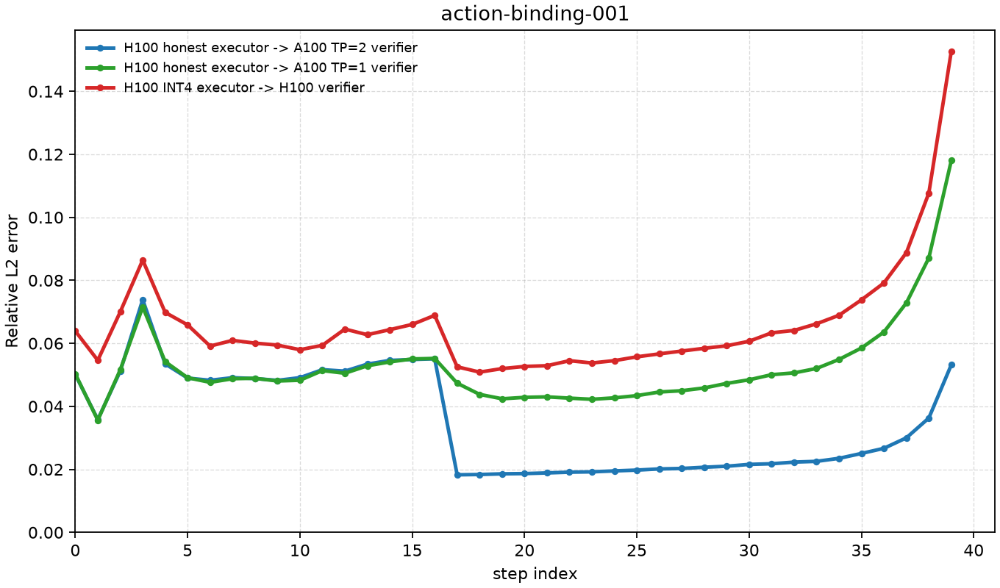

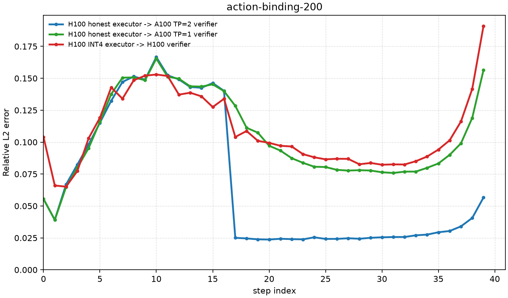

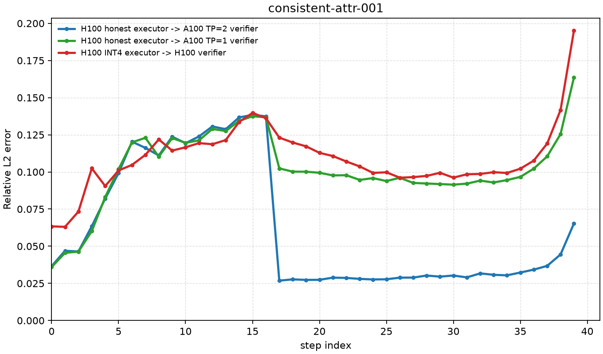

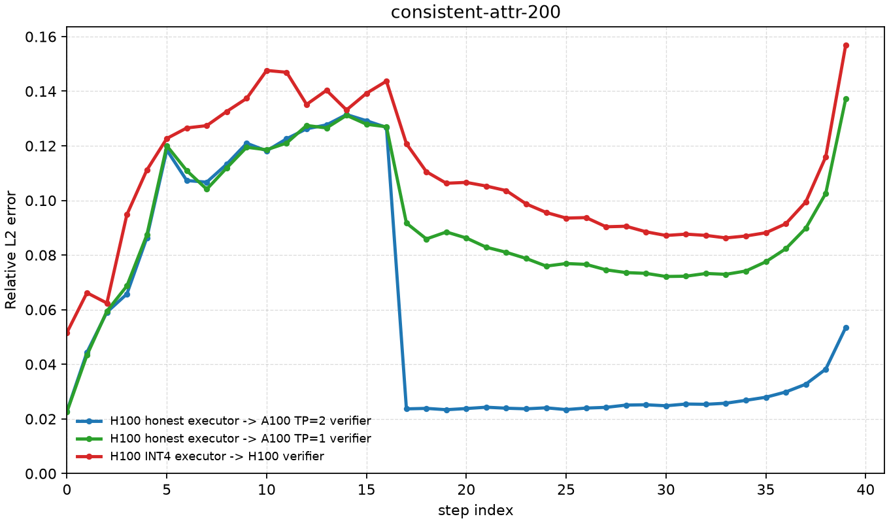

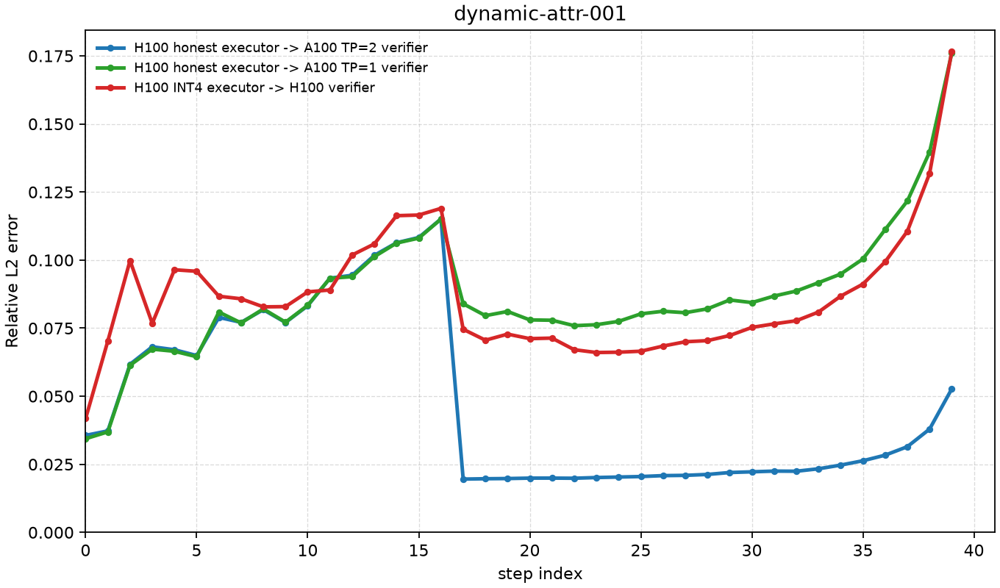

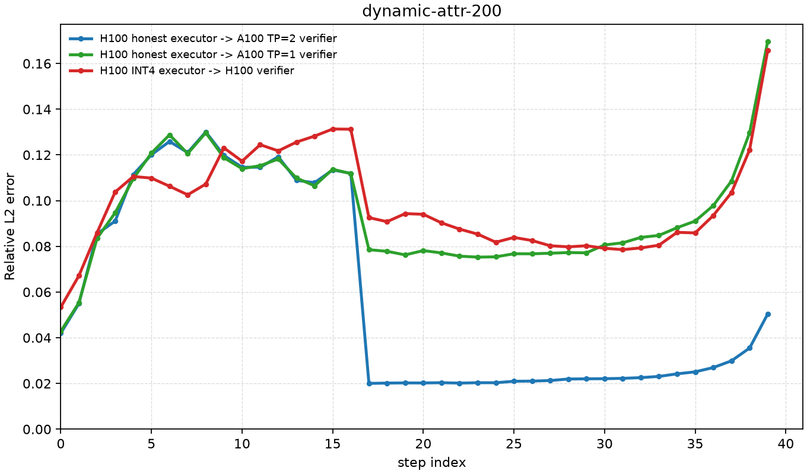

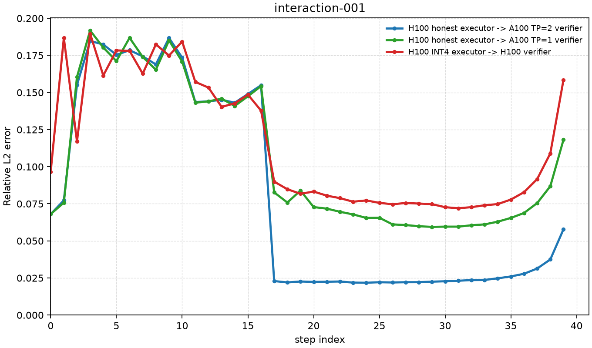

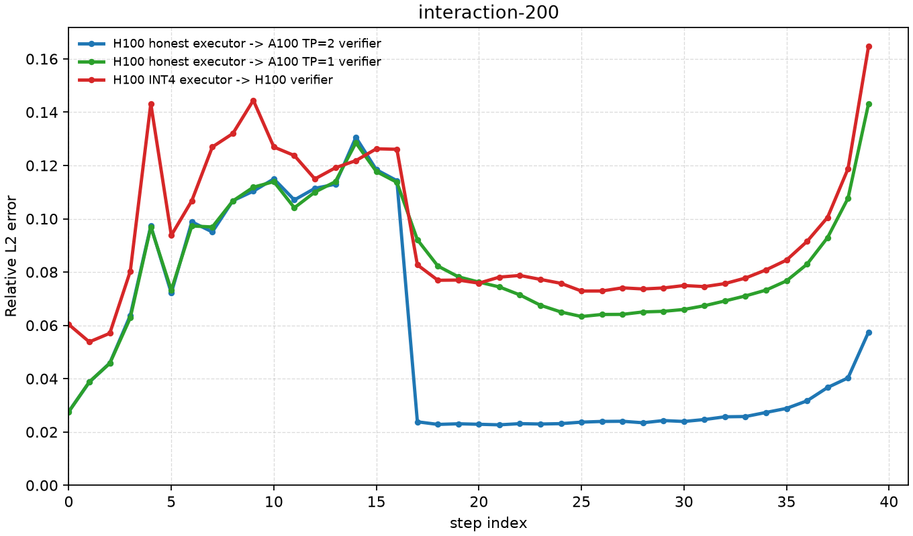

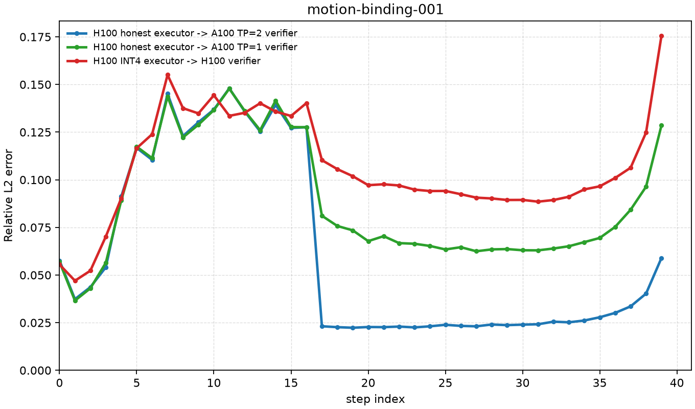

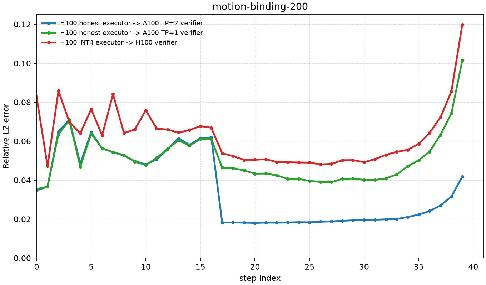

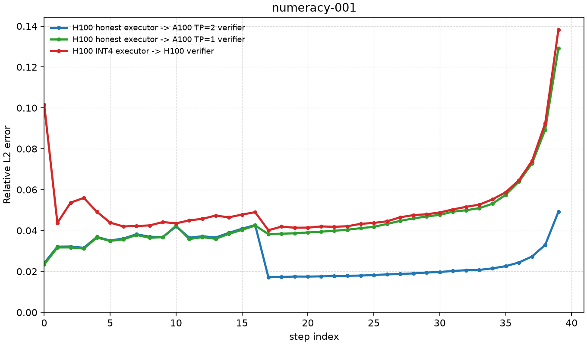

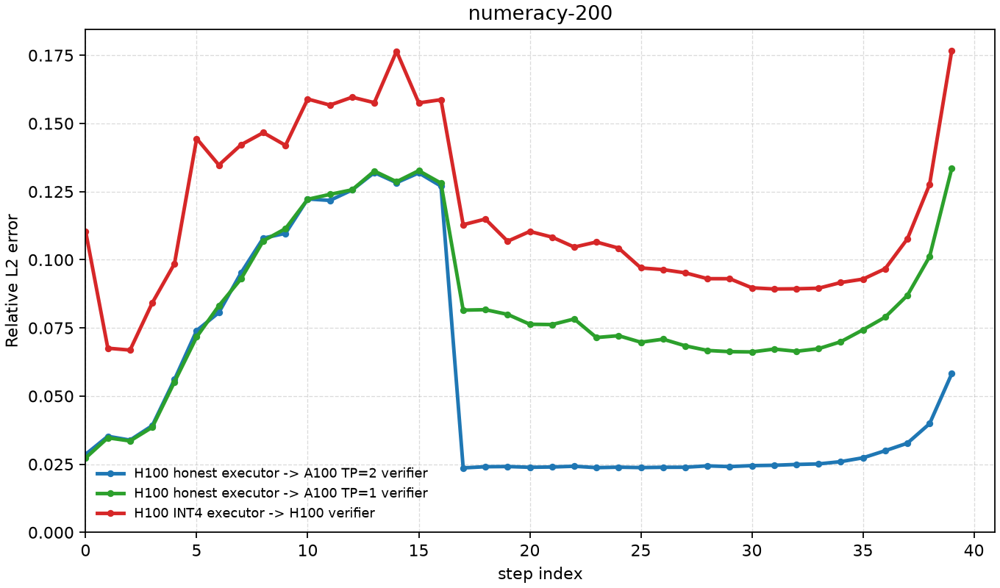

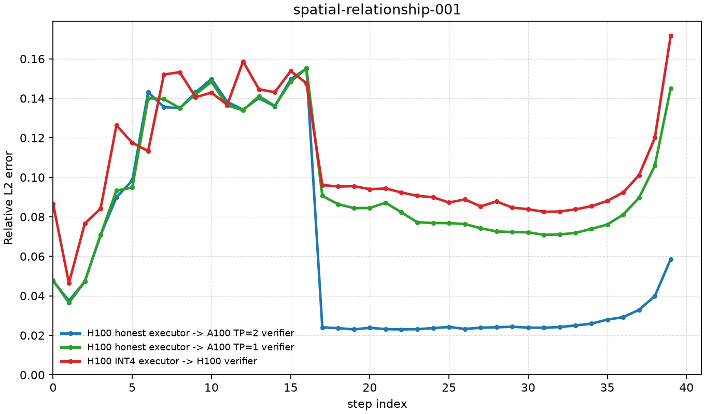

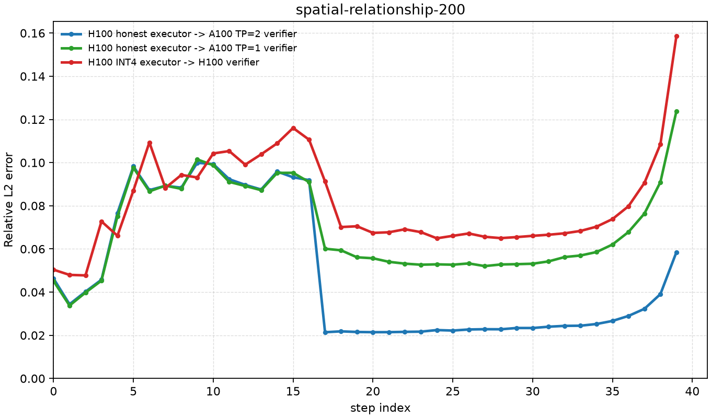

That overlap is the core problem. A threshold permissive enough to accept the single-A100 honest verifier would also accept many INT4 executions. A threshold strict enough to catch INT4 would reject honest single-A100 verification.

It is not clear exactly why the A100 TP=2 configuration performs better than a single A100. It is counterintuitive because TP=2 introduces more hardware variation, but the likely explanation is that the A100 TP=2 setup uses a kernel path that happens to land closer to H100 numerics than the single-A100 setup.

## Conclusion

For Wan2.2-T2V-A14B, I do not think we can reliably distinguish the full model from the INT4 model across arbitrary verifier hardware. The malicious deviation is too close to normal numeric drift from some honest verifier configurations.

One solution is to *narrow validation to the exact same GPU configuration*. This may be possible in a large network, but it assumes there is always a verifier available with the same GPU configuration and the same model variant as the executor. That requires a separate threat analysis. We could also loosen the requirement slightly by identifying specific GPU pairs that are workable. For example, if a B200 executor could be verified by an H200 verifier while still catching every dishonest inference, that pair could be allowed. However, this would complicate the protocol even more and require cross-calibration across many GPU combinations.

The safest strategy for a decentralized network is to **deploy the "least common denominator" model variant**: choose a baseline that does not have a cheaper counterpart capable of passing as that baseline. For such models, validation thresholds can be generous enough to absorb benign hardware differences.

That does not necessarily mean lower-quality outputs. The INT4 generations are often close to the full-model generations, and some could even be subjectively better. You can compare:

- INT4 medium outputs: `notes/03-validation-strategy/artifacts/medium__h100__int4_quantization`
- Full-model medium outputs: `notes/03-validation-strategy/artifacts/medium__h100__default`
- INT4 pilot outputs: `notes/03-validation-strategy/artifacts/pilot__h100__int4_quantization`
- Full-model pilot outputs from the previous experiment: `notes/02-intermediate-artifacts/artifacts/h100_sxm__default`

It is also worth noting that across 105 examples, the median per-prompt relative L2 error for the INT4 model is `0.08555`, corresponding to a similarity score of `0.921`. The worst per-prompt median is `0.15015`, corresponding to a similarity score of `0.869` (see `notes/03-validation-strategy/artifacts/comparisons/medium__h100_int4_vs_h100.json`).

---

### Original model examples

Two cars collide at an intersection

https://github.com/user-attachments/assets/80ad1168-f35b-43e4-8ec3-b3ee21729d9a

A rabbit wears a detective hat and a cat drives a toy car

https://github.com/user-attachments/assets/41e3da4b-7f59-4899-843e-a79f80d1f026

Five chairs sit around a campfire, and seven people roasting marshmallows.

https://github.com/user-attachments/assets/6c261baf-55af-42cf-a6ac-70bb03173610

A boy reading behind a bench

https://github.com/user-attachments/assets/d7a109e5-8cb2-4e4e-bf33-c5a00974c0c2


### INT4 quantized model examples

Two cars collide at an intersection

https://github.com/user-attachments/assets/05aef5d8-aa46-4c2b-a3a3-0cf5ed67dcf4

A rabbit wears a detective hat and a cat drives a toy car

https://github.com/user-attachments/assets/e6ab2f94-abb9-497f-a124-a597353edc3a

Five chairs sit around a campfire, and seven people roasting marshmallows.

https://github.com/user-attachments/assets/e2fcab41-8fab-4753-8176-9100c397a430

A boy reading behind a bench

https://github.com/user-attachments/assets/7ec2ee7a-8f9b-4612-9b9d-126070706bed